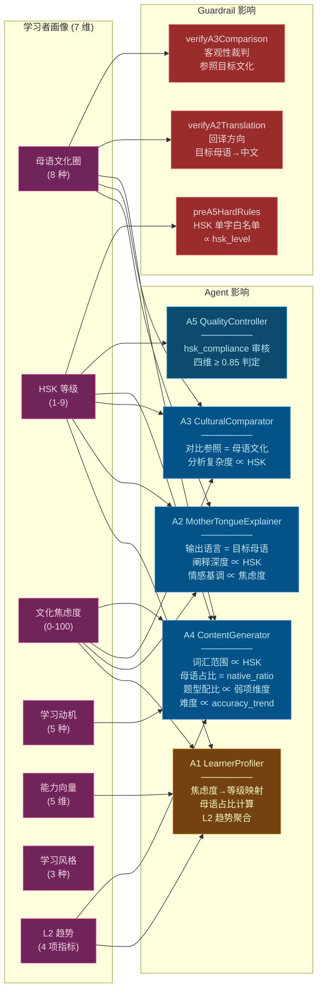

# Agent 协同 Mermaid 图集

## 1. Agent DAG 调用拓扑图

```mermaid
graph TB
    subgraph Legend["图例"]
        L_Agent["🤖 Agent 节点 (LLM)"]
        L_Compute["🖥 计算节点 (无 LLM)"]
        L_Guard["🛡 Guardrail 节点"]
        L_Merge["⏺ 汇聚节点"]
        L_Cache["📦 缓存节点"]
    end

    START((START)):::startEnd

    checkCache["📦 checkCache<br/>────────<br/>queryKnowledgeBase()<br/>三维复合主键检索<br/>(kpId, hskLevel, sceneId)<br/>双重校验: ACTIVE + C≥0.60"]:::cache

    genEx["🤖 generateExercises<br/>────────<br/>缓存命中短路路径<br/>A4 仅生成练习题<br/>+ solver 对抗盲测"]:::agent

    a1["🖥 A1 LearnerProfiler<br/>────────<br/>• 读 DB 焦虑度<br/>• anxietyScore → Level<br/>• 计算 native_ratio<br/>• getRecentLearningTrend()<br/>  聚合最近 5 轮评估"]:::compute

    a2["🤖 A2 MotherTongue<br/>Explainer<br/>────────<br/>• 目标母语文化阐释<br/>• JSON 结构化输出<br/>• 4 类硬约束<br/>• 3 层 HSK 指导<br/>⏱ 60s · t=0.3"]:::agent

    a3["🤖 A3 Cultural<br/>Comparator<br/>────────<br/>• Hofstede/Hall 框架<br/>• XML 四段输出<br/>• ≤100字/段<br/>⏱ 60s · t=0.3"]:::agent

    gA2["🛡 verifyA2Translation<br/>────────<br/>Step1: qwen3.6 目标母语→中文 回译<br/>Step2: DeepSeek NLI 裁判 True/False<br/>跨模型 + 跨语言 双保险"]:::guard

    gA3["🛡 verifyA3Comparison<br/>────────<br/>DeepSeek 三标准裁判<br/>① 客观性 (学术框架)<br/>② 无偏见 (无刻板印象)<br/>③ 事实基础 (可查证)"]:::guard

    merge["⏺ mergeA2A3<br/>────────<br/>fan-in 汇聚点<br/>等待 A2+A3 并行完成<br/>状态自动合并<br/>merge reducer 累积 guardrail"]:::merge

    a4["🤖 A4 ContentGenerator<br/>────────<br/>• 综合 A2阐释+A3对比+L2趋势<br/>• GeneratedContent 生成<br/>• 3-5 语言点 · 3-5 练习题<br/>• 涵盖 ≥2 种题型<br/>• &lt;adaptive_guidance&gt; 个性化注入<br/>⏱ 90s · t=0.3"]:::agent

    gA4_S["🛡 verifyA4Solver<br/>Adversarial<br/>────────<br/>DeepSeek 独立盲解<br/>选择题: A-D 精确匹配<br/>判断题: 对/错 匹配<br/>填空: 三级模糊匹配<br/>Promise.all 并发"]:::guard

    gA4_H["🛡 preA5HardRules<br/>Filter<br/>────────<br/>🖥 无 LLM 调用<br/>拼音格式正则校验<br/>HSK 单字颗粒度白名单<br/>确定性规则"]:::guard

    gA4_G["🛡 verifyA4Grounding<br/>────────<br/>DeepSeek 裁判<br/>练习题是否忠于<br/>A2 文化阐释内容<br/>防凭空编造"]:::guard

    a5["🤖 A5 QualityController<br/>────────<br/>四维盲审<br/>pinyin · distractor<br/>hsk_compliance · safety<br/>四项 ≥ 0.85 方合格<br/>⏱ 60s · t=0.0"]:::agent

    gA5["🛡 verifyA5Joint<br/>Arbitration<br/>────────<br/>DeepSeek 单模型四维评分<br/>(原双模型已降级)<br/>四项 ≥0.85 → PASS"]:::guard

    saveKB["📦 saveKB<br/>────────<br/>computeCacheConfidence()<br/>6种 guardrail 加权聚合<br/>C = Σw_i·c_i / Σw_i<br/>C≥0.60 → ACTIVE<br/>C<0.60 → REJECTED<br/>写入失败不阻塞返回"]:::cache

    END_CACHE((END)):::startEnd
    END_MAIN((END)):::startEnd

    START --> checkCache
    checkCache -->|"cache_hit"| genEx
    checkCache -->|"cache_miss"| a1
    genEx --> END_CACHE

    a1 --> a2
    a1 --> a3

    a2 --> gA2
    a3 --> gA3

    gA2 --> merge
    gA3 --> merge

    merge --> a4

    a4 --> gA4_S
    a4 --> gA4_H
    a4 --> gA4_G

    gA4_S --> a5
    gA4_H --> a5
    gA4_G --> a5

    a5 --> gA5
    gA5 --> saveKB
    saveKB --> END_MAIN

    classDef startEnd fill:#2d2d2d,stroke:#666,color:#fff
    classDef agent fill:#035388,stroke:#3182ce,color:#bee3f8
    classDef compute fill:#744210,stroke:#d69e2e,color:#fefcbf
    classDef guard fill:#9b2c2c,stroke:#fc8181,color:#fed7d7
    classDef merge fill:#2d3748,stroke:#718096,color:#e2e8f0
    classDef cache fill:#276749,stroke:#48bb78,color:#c6f6d5
```



## 2. Agent 协同序列图

```mermaid
sequenceDiagram
    actor User as 学习者
    participant API as API Gateway
    participant Cache as CacheManager
    participant A1 as A1 LearnerProfiler
    participant A2 as A2 MotherTongueExplainer
    participant A3 as A3 CulturalComparator
    participant A4 as A4 ContentGenerator
    participant A5 as A5 QualityController
    participant GR as GuardrailService
    participant DS as DeepSeek
    participant MM as qwen3.6
    participant DB as PostgreSQL

    Note over User,DB: ═══════════════════ 阶段 0: 缓存检索 ═══════════════════

    User->>API: POST /api/learning {learner_id, kp_id, hsk, native_lang}
    API->>DB: SELECT learners WHERE id=?
    DB-->>API: learner_profile
    API->>Cache: get(kpId, hskLevel, sceneId)
    Cache->>DB: SELECT llm_content_cache WHERE (kp, hsk, scene)
    DB-->>Cache: cache_entry | null

    alt 缓存命中
        Cache-->>API: cached_explanation + comparison
        API->>A4: 仅生成练习题 (cache shortcut)
        A4-->>API: GeneratedContent
        API->>GR: verifyA4SolverAdversarial
        GR->>DS: Solver 盲解
        DS-->>GR: Solver 答案
        GR-->>API: guardrail verdict
        API-->>User: 响应 (from_cache=true)
    else 缓存未命中
        Cache-->>API: null

        Note over User,DB: ═══════════════ 阶段 1: A1 画像建模 ═══════════════

        API->>A1: process({action:"calculate_anxiety", learner_profile})
        A1->>DB: SELECT assessment_records WHERE learner=? ORDER BY assessed_at DESC LIMIT 5
        DB-->>A1: 最近 5 轮评估记录
        A1->>A1: 焦虑度映射: score→{high,medium,low}
        A1->>A1: 母语占比: native_ratio∈{0.75,0.50,0.25}
        A1->>A1: L2 趋势聚合: weak_dims + trend + errors + scenes
        A1-->>API: anxiety_data + L2_trends

        Note over User,DB: ═══════════ 阶段 2: A2 ∥ A3 并行生成 ═══════════

        par A2 母语阐释
            API->>A2: process({kpId, targetLang, anxiety_level, hsk})
            A2->>A2: 构建 XML 标签约束 prompt<br/>&lt;system_prompt&gt;+&lt;strict_constraints&gt;<br/>+&lt;tier_guidelines&gt;+&lt;output_schema&gt;
            A2->>A2: LLM 生成 (DeepSeek, t=0.3, 60s)
            A2-->>API: cultural_explanation JSON
            API->>GR: verifyA2Translation(originalChinese, targetLang, explanation)
            GR->>MM: 回译: 目标母语→中文 (t=0)
            MM-->>GR: back_translation
            GR->>DS: NLI 裁判: "回译是否准确解释核心概念?" True/False (t=0)
            DS-->>GR: True | False
            GR-->>API: a2_translation verdict
        and A3 跨文化对比
            API->>A3: process({concept, targetCulture, hsk, anxiety})
            A3->>A3: 构建 Hofstede/Hall 框架 prompt
            A3->>A3: LLM 生成 (DeepSeek, t=0.3, 60s)
            A3-->>API: cross_cultural_comparison XML
            API->>GR: verifyA3Comparison(concept, culture, comparison)
            GR->>DS: 三标准裁判: 客观性+无偏见+事实基础 True/False (t=0)
            DS-->>GR: True | False
            GR-->>API: a3_comparison verdict
        end

        Note over User,DB: ═══════════ 阶段 3: A4 内容生成 ═══════════

        API->>A4: process({A2阐释, A3对比, L2趋势, hsk, scene})
        A4->>A4: 构建带 &lt;adaptive_guidance&gt; 的 prompt<br/>弱项维度占比≥40% · trend→难度调节 · 错误模式→靶向出题
        A4->>A4: LLM 生成 (DeepSeek, t=0.3, 90s)
        A4->>A4: validateExercisesFormat() 格式校验
        A4-->>API: generated_content

        Note over User,DB: ═══════════ 阶段 4: 三重 Guardrail ═══════════

        API->>GR: verifyA4SolverAdversarial(所有练习题)
        loop 逐题并发盲解
            GR->>DS: Solver prompt (选择题/判断/填空)
            DS-->>GR: Solver 答案
            GR->>GR: 逐题比对 (精确/子串/Levenshtein)
        end
        GR-->>API: a4_solver verdict

        API->>GR: preA5HardRulesFilter(题干, pinyin, HSK白名单)
        GR->>GR: 拼音字符集正则校验
        GR->>GR: HSK 单字颗粒度白名单比对
        GR-->>API: a4_hard_rules verdict

        API->>GR: verifyA4Grounding(A2阐释, 练习题题干)
        GR->>DS: 裁判: "练习题是否忠于阐释?" True/False
        DS-->>GR: True | False
        GR-->>API: a4_grounding verdict

        Note over User,DB: ═══════════ 阶段 5: A5 质量审核 ═══════════

        API->>A5: process({generated_content, hsk_level})
        A5->>A5: 四维盲审 (DeepSeek, t=0.0, 60s)<br/>pinyin_score · distractor_score<br/>hsk_compliance_score · safety_score
        A5-->>API: quality_review {is_qualified, scores, feedback}

        Note over User,DB: ═══════════ 阶段 6: 单模型仲裁(降级) ═══════════

        API->>GR: verifyA5JointArbitration(exercises, hsk)
        GR->>DS: 四维评分 prompt (t=0) (单模型, 原MiniMax已降级)
        DS-->>GR: ds_scores
        GR->>GR: parseA5Response() 解析<br/>四项 ≥0.85 → PASS
        GR-->>API: a5_joint verdict

        Note over User,DB: ═══════════ 阶段 7: 异步回写 ═══════════

        API->>GR: computeCacheConfidence(guardrail_results)
        GR->>GR: weightedSum / totalWeight<br/>w: a5=0.40 a2=0.25 a3=0.15<br/>grounding=0.10 hard=0.05 solver=0.05
        GR-->>API: weighted_confidence
        API->>Cache: upsert(kpId, hsk, scene, payload, confidence)
        Cache->>DB: UPSERT llm_content_cache
        Note over DB: C<0.60 → REJECTED

        API-->>User: 完整响应 {cultural_explanation, comparison,<br/>learning_content, guardrail_results,<br/>anxiety_level, from_cache, engine}
    end
```

## 3. 学习者画像 → Agent 影响路径图


