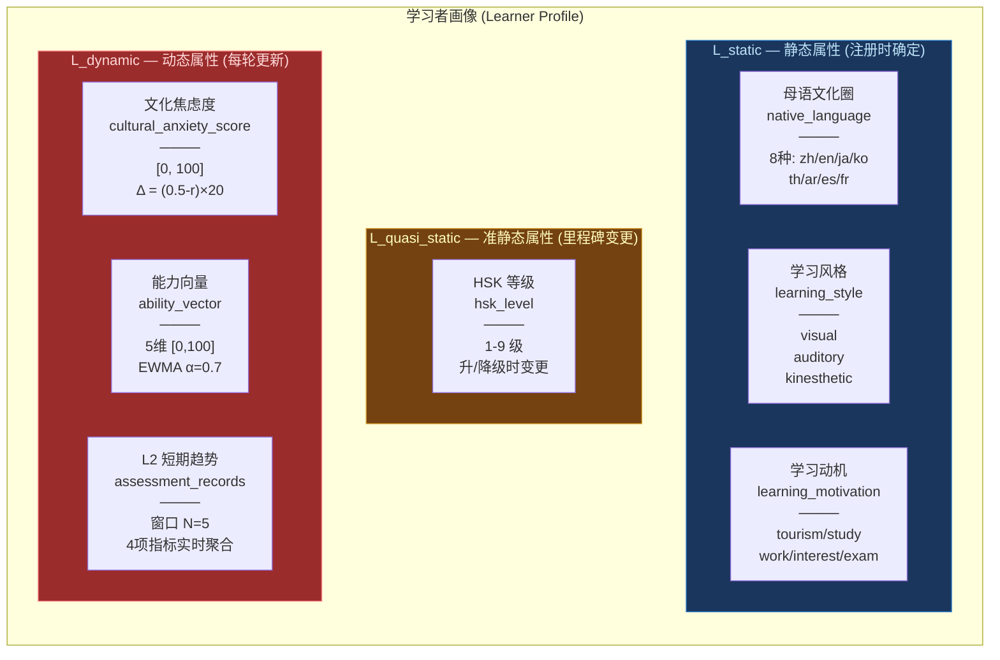
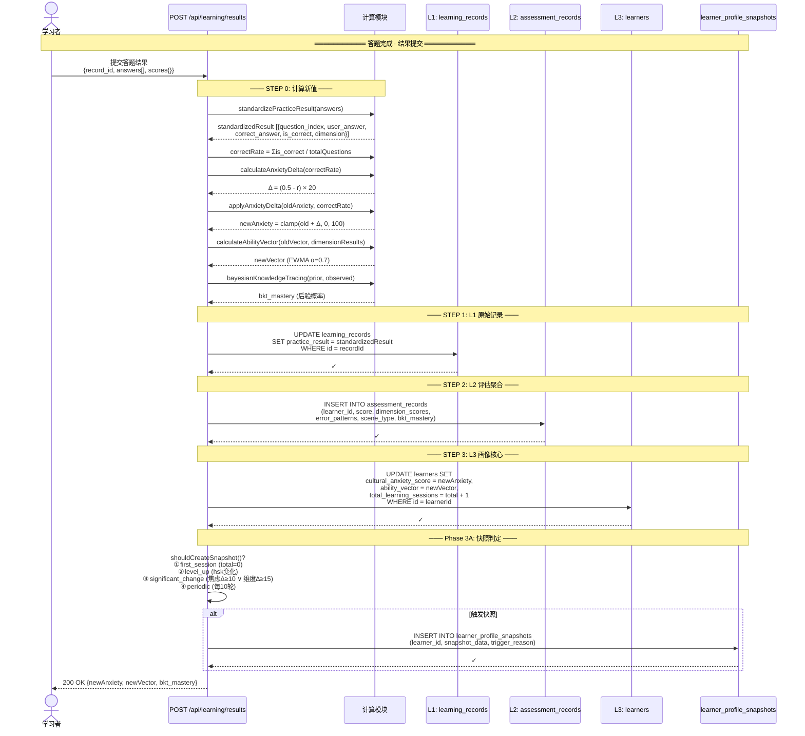
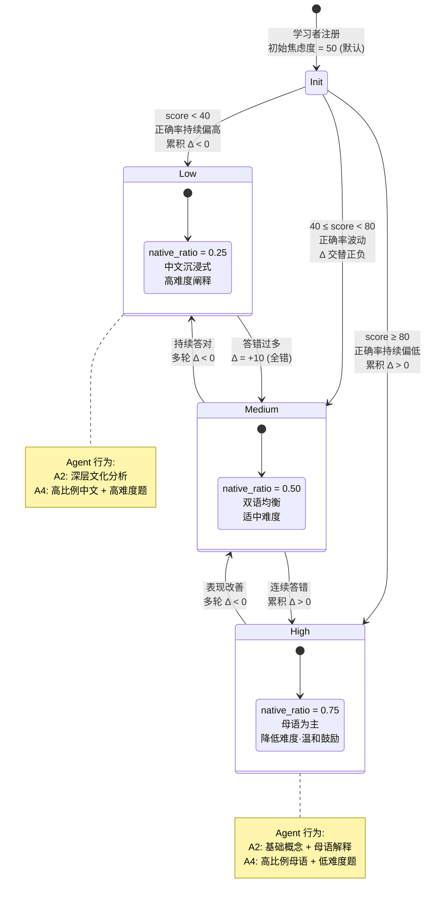
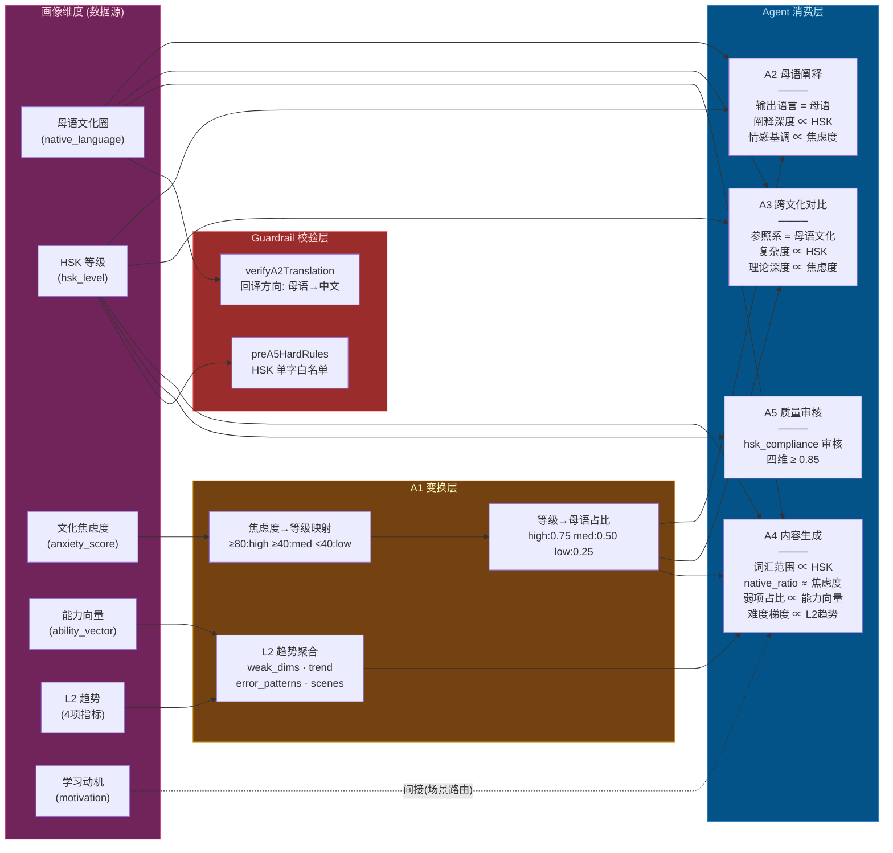
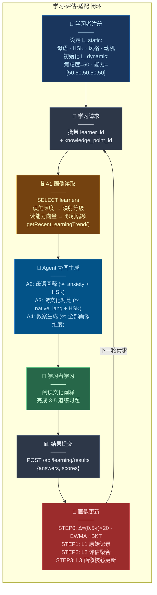
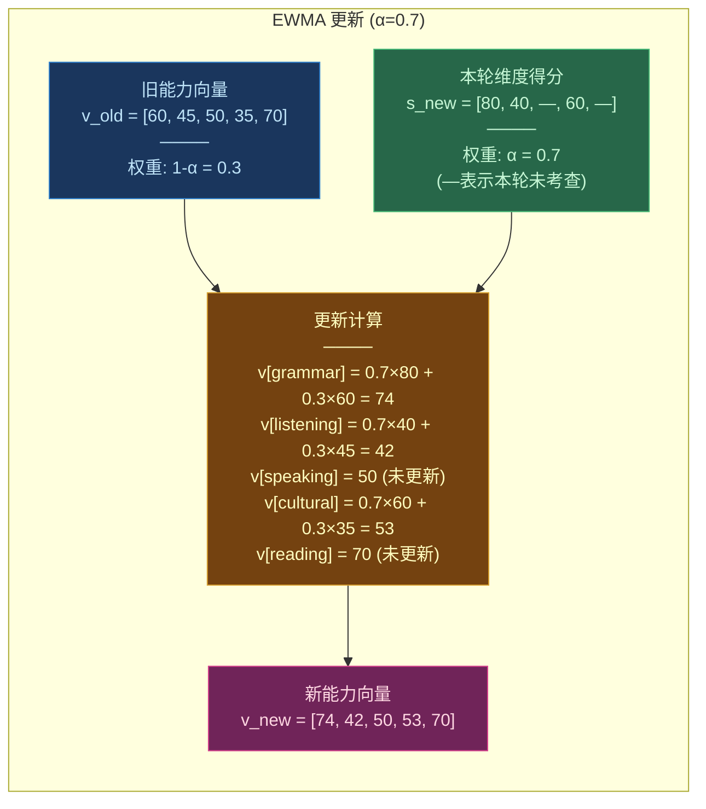

# 学习者画像 Mermaid 图集

## 1. 七维画像结构图

```mermaid
graph TB
    subgraph Profile["学习者画像 (Learner Profile)"]
        direction TB
        
        subgraph Static["L_static — 静态属性 (注册时确定)"]
            direction LR
            S1["母语文化圈<br/>native_language<br/>────<br/>8种: zh/en/ja/ko<br/>th/ar/es/fr"]
            S2["学习风格<br/>learning_style<br/>────<br/>visual<br/>auditory<br/>kinesthetic"]
            S3["学习动机<br/>learning_motivation<br/>────<br/>tourism/study<br/>work/interest/exam"]
        end

        subgraph QuasiStatic["L_quasi_static — 准静态属性 (里程碑变更)"]
            direction LR
            Q1["HSK 等级<br/>hsk_level<br/>────<br/>1-9 级<br/>升/降级时变更"]
        end

        subgraph Dynamic["L_dynamic — 动态属性 (每轮更新)"]
            direction LR
            D1["文化焦虑度<br/>cultural_anxiety_score<br/>────<br/>[0, 100]<br/>Δ = (0.5-r)×20"]
            D2["能力向量<br/>ability_vector<br/>────<br/>5维 [0,100]<br/>EWMA α=0.7"]
            D3["L2 短期趋势<br/>assessment_records<br/>────<br/>窗口 N=5<br/>4项指标实时聚合"]
        end
    end

    style Static fill:#1a365d,stroke:#3182ce,color:#bee3f8
    style QuasiStatic fill:#744210,stroke:#d69e2e,color:#fefcbf
    style Dynamic fill:#9b2c2c,stroke:#fc8181,color:#fed7d7
```

## 2. 画像更新 L1/L2/L3 管线序列图

```mermaid
sequenceDiagram
    actor User as 学习者
    participant API as POST /api/learning/results
    participant Calc as 计算模块
    participant L1 as L1: learning_records
    participant L2 as L2: assessment_records
    participant L3 as L3: learners
    participant Snap as learner_profile_snapshots

    Note over User,Snap: ═══════════ 答题完成 · 结果提交 ═══════════

    User->>API: 提交答题结果<br/>{record_id, answers[], scores{}}

    Note over API,Calc: ─── STEP 0: 计算新值 ───

    API->>Calc: standardizePracticeResult(answers)
    Calc-->>API: standardizedResult [{question_index, user_answer,<br/>correct_answer, is_correct, dimension}]

    API->>Calc: correctRate = Σis_correct / totalQuestions
    API->>Calc: calculateAnxietyDelta(correctRate)
    Calc-->>API: Δ = (0.5 - r) × 20

    API->>Calc: applyAnxietyDelta(oldAnxiety, correctRate)
    Calc-->>API: newAnxiety = clamp(old + Δ, 0, 100)

    API->>Calc: calculateAbilityVector(oldVector, dimensionResults)
    Calc-->>API: newVector (EWMA α=0.7)

    API->>Calc: bayesianKnowledgeTracing(prior, observed)
    Calc-->>API: bkt_mastery (后验概率)

    Note over API,Snap: ─── STEP 1: L1 原始记录 ───

    API->>L1: UPDATE learning_records<br/>SET practice_result = standardizedResult<br/>WHERE id = recordId
    L1-->>API: ✓

    Note over API,Snap: ─── STEP 2: L2 评估聚合 ───

    API->>L2: INSERT INTO assessment_records<br/>(learner_id, score, dimension_scores,<br/>error_patterns, scene_type, bkt_mastery)
    L2-->>API: ✓

    Note over API,Snap: ─── STEP 3: L3 画像核心 ───

    API->>L3: UPDATE learners SET<br/>cultural_anxiety_score = newAnxiety,<br/>ability_vector = newVector,<br/>total_learning_sessions = total + 1<br/>WHERE id = learnerId
    L3-->>API: ✓

    Note over API,Snap: ─── Phase 3A: 快照判定 ───

    API->>API: shouldCreateSnapshot()?<br/>① first_session (total=0)<br/>② level_up (hsk变化)<br/>③ significant_change (焦虑Δ≥10 ∨ 维度Δ≥15)<br/>④ periodic (每10轮)

    alt 触发快照
        API->>Snap: INSERT INTO learner_profile_snapshots<br/>(learner_id, snapshot_data, trigger_reason)
        Snap-->>API: ✓
    end

    API-->>User: 200 OK {newAnxiety, newVector, bkt_mastery}
```

## 3. 文化焦虑度生命周期

```mermaid
stateDiagram-v2
    [*] --> Init: 学习者注册<br/>初始焦虑度 = 50 (默认)

    Init --> Low: score < 40<br/>正确率持续偏高<br/>累积 Δ < 0

    Init --> Medium: 40 ≤ score < 80<br/>正确率波动<br/>Δ 交替正负

    Init --> High: score ≥ 80<br/>正确率持续偏低<br/>累积 Δ > 0

    Low --> Medium: 答错过多<br/>Δ = +10 (全错)
    Medium --> Low: 持续答对<br/>多轮 Δ < 0
    Medium --> High: 连续答错<br/>累积 Δ > 0
    High --> Medium: 表现改善<br/>多轮 Δ < 0

    state Low {
        [*] --> L_Behavior
        L_Behavior: native_ratio = 0.25<br/>中文沉浸式<br/>高难度阐释
    }

    state Medium {
        [*] --> M_Behavior
        M_Behavior: native_ratio = 0.50<br/>双语均衡<br/>适中难度
    }

    state High {
        [*] --> H_Behavior
        H_Behavior: native_ratio = 0.75<br/>母语为主<br/>降低难度·温和鼓励
    }

    note right of Low
        Agent 行为:
        A2: 深层文化分析
        A4: 高比例中文 + 高难度题
    end note

    note right of High
        Agent 行为:
        A2: 基础概念 + 母语解释
        A4: 高比例母语 + 低难度题
    end note
```

## 4. 画像 → Agent 影响流向图

```mermaid
graph LR
    subgraph Source["画像维度 (数据源)"]
        direction TB
        NL["母语文化圈<br/>(native_language)"]
        HSK["HSK 等级<br/>(hsk_level)"]
        ANX["文化焦虑度<br/>(anxiety_score)"]
        VEC["能力向量<br/>(ability_vector)"]
        L2T["L2 趋势<br/>(4项指标)"]
        MOT["学习动机<br/>(motivation)"]
    end

    subgraph Transform["A1 变换层"]
        direction TB
        T1["焦虑度→等级映射<br/>≥80:high ≥40:med <40:low"]
        T2["等级→母语占比<br/>high:0.75 med:0.50 low:0.25"]
        T3["L2 趋势聚合<br/>weak_dims · trend<br/>error_patterns · scenes"]
    end

    subgraph Agent["Agent 消费层"]
        direction TB
        A2["A2 母语阐释<br/>────<br/>输出语言 = 母语<br/>阐释深度 ∝ HSK<br/>情感基调 ∝ 焦虑度"]
        A3["A3 跨文化对比<br/>────<br/>参照系 = 母语文化<br/>复杂度 ∝ HSK<br/>理论深度 ∝ 焦虑度"]
        A4["A4 内容生成<br/>────<br/>词汇范围 ∝ HSK<br/>native_ratio ∝ 焦虑度<br/>弱项占比 ∝ 能力向量<br/>难度梯度 ∝ L2趋势"]
        A5["A5 质量审核<br/>────<br/>hsk_compliance 审核<br/>四维 ≥ 0.85"]
    end

    subgraph Guard["Guardrail 校验层"]
        direction TB
        G1["preA5HardRules<br/>HSK 单字白名单"]
        G2["verifyA2Translation<br/>回译方向: 母语→中文"]
    end

    ANX --> T1
    T1 --> T2
    VEC --> T3
    L2T --> T3

    NL --> A2
    NL --> A3
    NL --> A4
    NL --> G2

    HSK --> A2
    HSK --> A3
    HSK --> A4
    HSK --> A5
    HSK --> G1

    T2 --> A2
    T2 --> A3
    T2 --> A4

    T3 --> A4

    MOT -.->|"间接(场景路由)"| A4

    style Source fill:#702459,stroke:#d53f8c,color:#fed7e2
    style Transform fill:#744210,stroke:#d69e2e,color:#fefcbf
    style Agent fill:#035388,stroke:#3182ce,color:#bee3f8
    style Guard fill:#9b2c2c,stroke:#fc8181,color:#fed7d7
```

## 5. 自适应闭环总览图

```mermaid
graph TB
    subgraph Loop["学习-评估-适配 闭环"]
        direction TB

        REG["📝 学习者注册<br/>────<br/>设定 L_static:<br/>母语 · HSK · 风格 · 动机<br/>初始化 L_dynamic:<br/>焦虑度=50 · 能力=[50,50,50,50,50]"]

        REQ["📡 学习请求<br/>────<br/>携带 learner_id<br/>+ knowledge_point_id"]

        A1_READ["🖥 A1 画像读取<br/>────<br/>SELECT learners<br/>读焦虑度 → 映射等级<br/>读能力向量 → 识别弱项<br/>getRecentLearningTrend()"]

        GEN["🤖 Agent 协同生成<br/>────<br/>A2: 母语阐释 (∝ anxiety + HSK)<br/>A3: 跨文化对比 (∝ native_lang + HSK)<br/>A4: 教案生成 (∝ 全部画像维度)"]

        LEARN["📖 学习者学习<br/>────<br/>阅读文化阐释<br/>完成 3-5 道练习题"]

        SUBMIT["📊 结果提交<br/>────<br/>POST /api/learning/results<br/>{answers, scores}"]

        UPDATE["🔄 画像更新<br/>────<br/>STEP0: Δ=(0.5-r)×20 · EWMA · BKT<br/>STEP1: L1 原始记录<br/>STEP2: L2 评估聚合<br/>STEP3: L3 画像核心更新"]

        REG --> REQ
        REQ --> A1_READ
        A1_READ --> GEN
        GEN --> LEARN
        LEARN --> SUBMIT
        SUBMIT --> UPDATE
        UPDATE -->|"下一轮请求"| REQ
    end

    style REG fill:#1a365d,stroke:#3182ce,color:#bee3f8
    style REQ fill:#2d3748,stroke:#718096,color:#e2e8f0
    style A1_READ fill:#744210,stroke:#d69e2e,color:#fefcbf
    style GEN fill:#035388,stroke:#3182ce,color:#bee3f8
    style LEARN fill:#276749,stroke:#48bb78,color:#c6f6d5
    style SUBMIT fill:#2d3748,stroke:#718096,color:#e2e8f0
    style UPDATE fill:#9b2c2c,stroke:#fc8181,color:#fed7d7
```

## 6. 能力向量 EWMA 更新示意

```mermaid
graph LR
    subgraph EWMA["EWMA 更新 (α=0.7)"]
        direction TB
        OLD["旧能力向量<br/>v_old = [60, 45, 50, 35, 70]<br/>────<br/>权重: 1-α = 0.3"]
        NEW["本轮维度得分<br/>s_new = [80, 40, —, 60, —]<br/>────<br/>权重: α = 0.7<br/>(—表示本轮未考查)"]
        CALC["更新计算<br/>────<br/>v[grammar] = 0.7×80 + 0.3×60 = 74<br/>v[listening] = 0.7×40 + 0.3×45 = 42<br/>v[speaking] = 50 (未更新)<br/>v[cultural] = 0.7×60 + 0.3×35 = 53<br/>v[reading] = 70 (未更新)"]
        RESULT["新能力向量<br/>v_new = [74, 42, 50, 53, 70]"]

        OLD --> CALC
        NEW --> CALC
        CALC --> RESULT
    end

    style OLD fill:#1a365d,stroke:#3182ce,color:#bee3f8
    style NEW fill:#276749,stroke:#48bb78,color:#c6f6d5
    style CALC fill:#744210,stroke:#d69e2e,color:#fefcbf
    style RESULT fill:#702459,stroke:#d53f8c,color:#fed7e2
```
