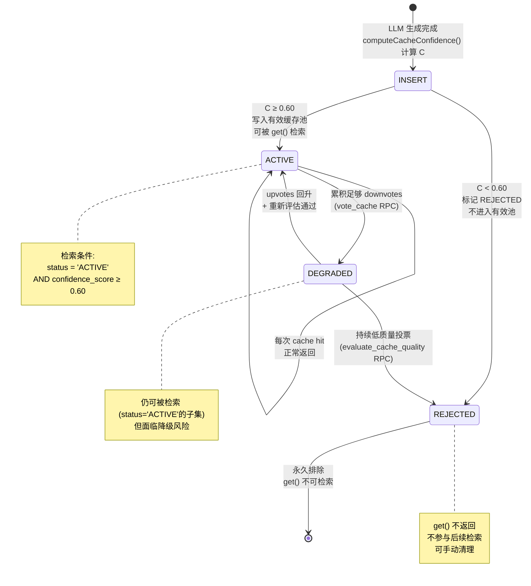
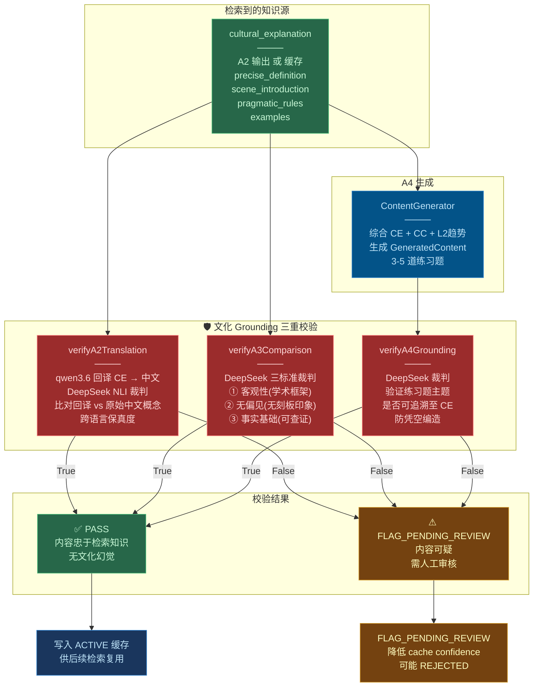
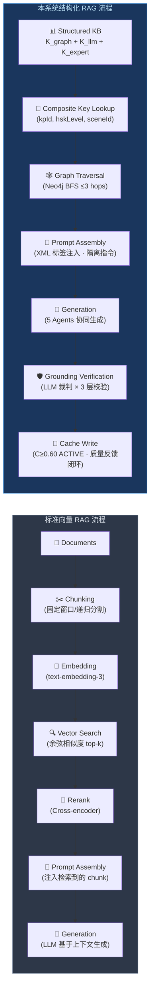

# RAG 知识增强生成 Mermaid 图集

## 1. 混合知识底座架构图

```mermaid
graph TB
    subgraph KnowledgeBase["混合知识底座 K = K_graph ∪ K_llm ∪ K_expert"]
        
        subgraph K_graph["K_graph — Neo4j 图数据库"]
            direction TB
            N1["CultureNode<br/>文化知识点节点<br/>id · topic · hsk_level<br/>category · subcategory"]
            N2["CONTRASTS_WITH<br/>跨文化对比关系<br/>target_culture · cultural_dimension<br/>similarities · differences"]
            N3["BELONGS_TO / RELATED_TO<br/>层级归属 · 语义关联"]
            N1 --- N2 --- N3
        end

        subgraph K_llm["K_llm — PostgreSQL 缓存"]
            direction TB
            C1["llm_content_cache<br/>复合主键: (kp_id, hsk_level, scene_id)"]
            C2["content_payload<br/>{cultural_explanation<br/>cross_cultural_comparison}"]
            C3["quality metadata<br/>confidence_score · upvotes<br/>downvotes · status"]
            C1 --- C2 --- C3
        end

        subgraph K_expert["K_expert — 专家审核"]
            direction TB
            E1["expert_review_queue<br/>待审内容队列"]
            E2["vote_cache() RPC<br/>用户赞/踩投票"]
            E3["evaluate_cache_quality()<br/>手动质量评估"]
            E1 --- E2 --- E3
        end

        subgraph K_structured["PostgreSQL 结构化知识表"]
            direction TB
            S1["cultural_knowledge_points<br/>知识点主数据 · 多语言 content_json"]
            S2["cultural_explanations<br/>按 (kp_id, language_code) 索引"]
            S3["cross_cultural_comparisons<br/>按 (source, target_culture) 索引"]
            S1 --- S2 --- S3
        end
    end

    style K_graph fill:#1a365d,stroke:#3182ce,color:#bee3f8
    style K_llm fill:#276749,stroke:#48bb78,color:#c6f6d5
    style K_expert fill:#744210,stroke:#d69e2e,color:#fefcbf
    style K_structured fill:#702459,stroke:#d53f8c,color:#fed7e2
```



## 2. 检索-生成-Grounding 全流程

```mermaid
sequenceDiagram
    actor User as 学习者
    participant API as API Gateway
    participant Scene as 场景映射器
    participant Cache as CacheManager (K_llm)
    participant Neo4j as Neo4j (K_graph)
    participant PgSQL as PostgreSQL
    participant A1 as A1 画像建模
    participant A2 as A2 母语阐释
    participant A3 as A3 跨文化对比
    participant A4 as A4 内容生成
    participant GR as GuardrailService
    participant DS as DeepSeek 裁判

    Note over User,DS: ═══════════════════ 检索阶段 ═══════════════════

    User->>API: POST /api/learning {kp_id, hsk, native_lang}

    API->>Scene: getSceneType(kpId, keywords)
    Scene-->>API: scene_id (daily/campus/food/...)

    par 复合主键精确检索 (主路径)
        API->>Cache: get(kpId, hskLevel, sceneId)
        Cache->>PgSQL: SELECT FROM llm_content_cache<br/>WHERE (kp, hsk, scene)<br/>AND status='ACTIVE'<br/>AND confidence>=0.60
        PgSQL-->>Cache: cache_entry | null
        Cache-->>API: cultural_explanation + comparison | null
    and Neo4j 图检索 (语义扩展)
        API->>Neo4j: queryCrossCulturalContrast(kpId, targetCulture)
        Neo4j->>Neo4j: MATCH (n)-[r:CONTRASTS_WITH]->(target)
        Neo4j-->>API: graph contrast data
    and PostgreSQL 结构化查询
        API->>PgSQL: SELECT FROM cultural_knowledge_points<br/>WHERE id=kpId
        PgSQL-->>API: content_json {zh, en, ja, ko...}
    end

    alt 缓存命中 (主路径生效)
        Note over API: from_cache=true · 短路路径
        API->>API: 跳过 A1-A3 LLM 调用

        Note over User,DS: ═══════════ 增强阶段 (缓存路径) ═══════════

        API->>A4: process({cached_explanation, cached_comparison})
        Note over A4: prompt 注入:<br/>&lt;cultural_explanation&gt;缓存阐释&lt;/cultural_explanation&gt;<br/>&lt;cross_cultural_comparison&gt;缓存对比&lt;/cross_cultural_comparison&gt;

        Note over User,DS: ═══════════ Grounding 校验 ═══════════

        API->>GR: verifyA4Grounding(缓存阐释, 练习题题干)
        GR->>DS: "练习题是否忠于文化阐释?" True/False
        DS-->>GR: True | False
        GR-->>API: grounding verdict
        API-->>User: 响应 (from_cache=true)

    else 缓存未命中 (LLM 生成路径)
        Note over API: from_cache=false · 完整路径

        Note over User,DS: ═══════════ 生成阶段 (LLM 路径) ═══════════

        API->>A1: 画像建模 (读 DB 焦虑度 + L2 趋势)
        A1-->>API: anxiety_level, native_ratio, L2 trends

        par A2 文化阐释生成
            API->>A2: process({kpId, targetLang, anxiety, hsk})
            Note over A2: 检索知识注入:<br/>knowledge_point_id → 确定文化主题<br/>target_language → 约束输出语言
            A2-->>API: cultural_explanation JSON
        and A3 跨文化对比生成
            API->>A3: process({concept, targetCulture, hsk})
            Note over A3: 检索知识注入:<br/>chinese_culture_point → 对比锚点<br/>target_culture → 参照文化
            A3-->>API: cross_cultural_comparison XML
        end

        Note over User,DS: ═══════════ Grounding 校验 (三层) ═══════════

        API->>GR: verifyA2Translation(原始中文, targetLang, A2阐释)
        GR->>DS: NLI 裁判: "回译是否准确解释核心概念?"
        DS-->>GR: True | False
        GR-->>API: a2_translation verdict (跨语言保真度)

        API->>GR: verifyA3Comparison(concept, culture, A3对比)
        GR->>DS: 三标准裁判: 客观性+无偏见+事实基础
        DS-->>GR: True | False
        GR-->>API: a3_comparison verdict (文化客观性)

        Note over User,DS: ═══════════ 增强+生成 ═══════════

        API->>A4: process({A2阐释, A3对比, L2趋势, scene, hsk})
        Note over A4: 增强 prompt 注入:<br/>&lt;cultural_explanation&gt;A2输出&lt;/cultural_explanation&gt;<br/>&lt;cross_cultural_comparison&gt;A3输出&lt;/cross_cultural_comparison&gt;<br/>&lt;adaptive_guidance&gt;L2趋势&lt;/adaptive_guidance&gt;
        A4-->>API: generated_content (文化背景+语言点+练习题)

        API->>GR: verifyA4Grounding(A2阐释, 练习题)
        GR->>DS: "练习题是否忠于文化阐释?"
        DS-->>GR: True | False
        GR-->>API: grounding verdict (内容忠实度)

        Note over User,DS: ═══════════ 缓存回写 ═══════════

        API->>API: computeCacheConfidence(6种guardrail加权聚合)
        API->>Cache: upsert(kpId, hsk, scene, payload, confidence)
        Note over Cache: C≥0.60 → ACTIVE<br/>C<0.60 → REJECTED

        API-->>User: 完整响应 (from_cache=false)
    end
```

## 3. 缓存生命周期状态机



## 4. 知识 Grounding 验证流程



## 5. 结构化 RAG vs 标准向量 RAG 对比


