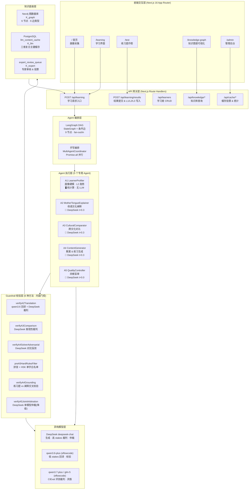
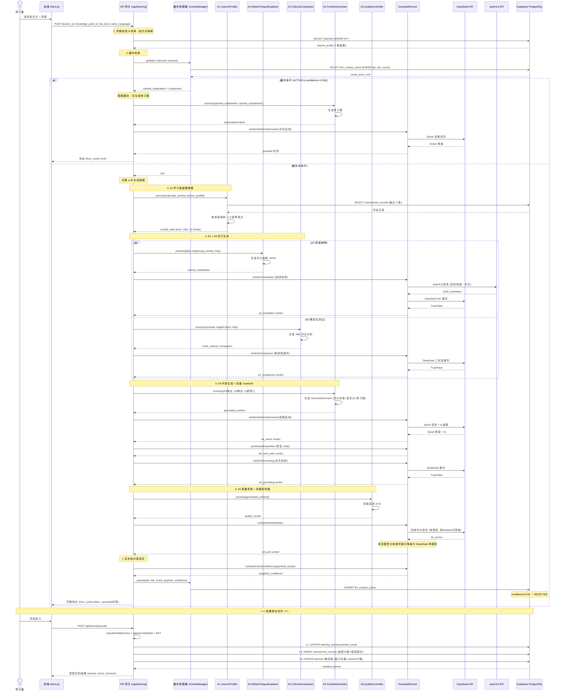
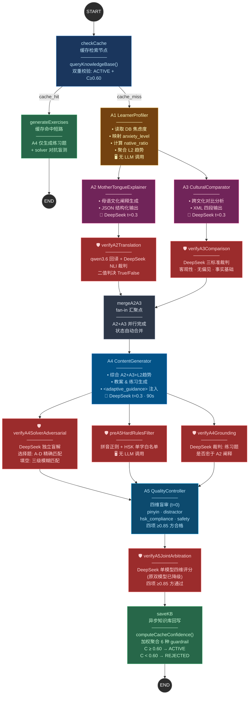

# 系统架构 Mermaid 图集

## 1. 总架构图

## 2. 数据流图：完整请求生命周期

## 3. Agent 协同图：DAG 拓扑与 Guardrail 节点

### Guardrail 节点详解

| 节点 | 插入位置 | 依赖模型 | 判决类型 | 失败处理 |
|------|----------|----------|----------|----------|
| 🛡 verifyA2Translation | A2 → mergeA2A3 | qwen3.6 + DeepSeek | 二值 True/False | FLAG_PENDING_REVIEW |
| 🛡 verifyA3Comparison | A3 → mergeA2A3 | DeepSeek | 二值 True/False | FLAG_PENDING_REVIEW |
| 🛡 verifyA4SolverAdversarial | A4 → A5 | DeepSeek | 逐题对比 | FLAG_REJECT |
| 🛡 preA5HardRulesFilter | A4 → A5 | 无 | 规则匹配 | FLAG_PENDING_REVIEW |
| 🛡 verifyA4Grounding | A4 → A5 | DeepSeek | 二值 True/False | FLAG_PENDING_REVIEW |
| 🛡 verifyA5JointArbitration | A5 → saveKB | DeepSeek 单模型 | 四维评分(原双模型已降级) | FLAG_PENDING_REVIEW |
